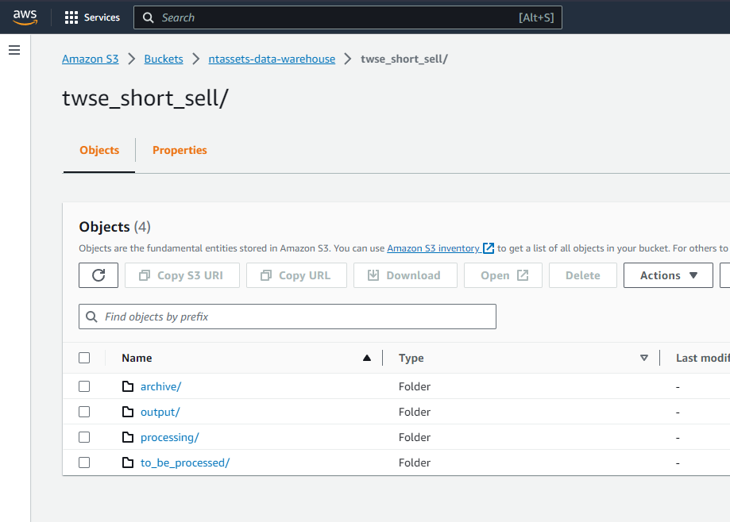
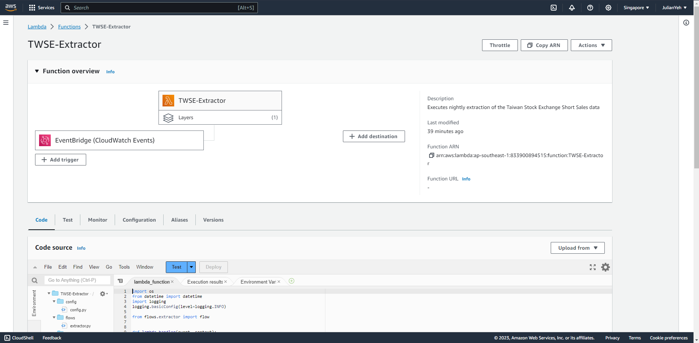
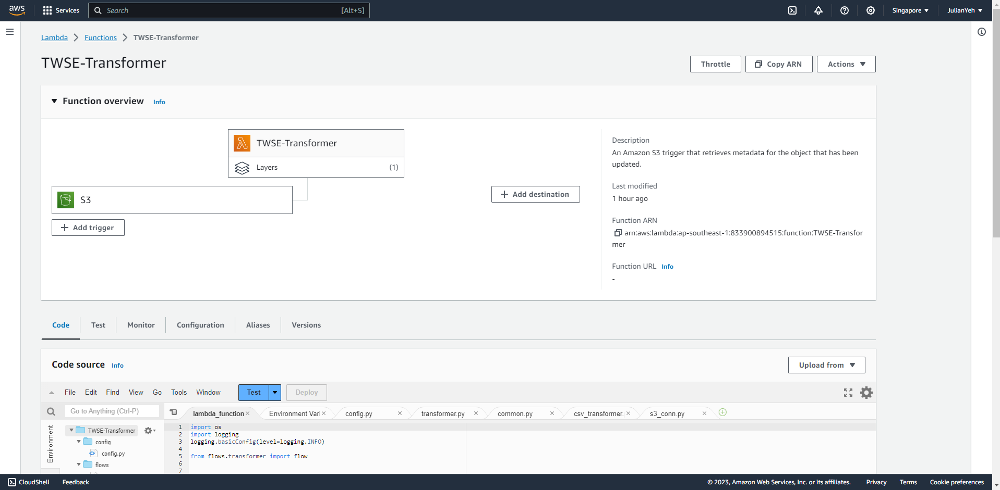
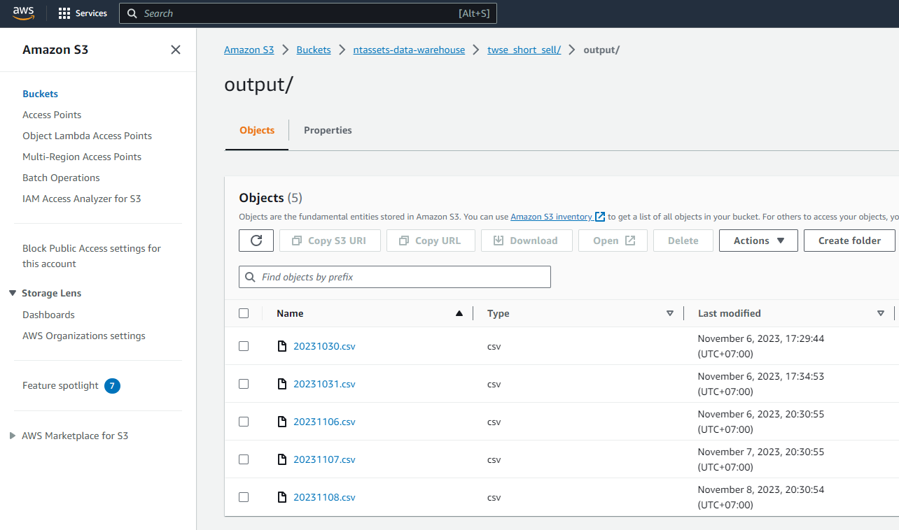

# twse-etl
This project contains the source code for the TWSE data pipeline.

## Overview
The pipeline is decoupled into two parts: extraction and transformation.

As shown in the diagram above, the extraction will be triggered daily via EventBridge and executed with a Lambda function. The raw HTML data will be saved to a S3 prefix for further processing. 

The transformation pipeline will be triggered by an S3 trigger listening to the /to_be_processed/ prefix for any created objects. Again, a Lambda function is used here to transform the raw data and saving it to /output/ on S3. After processing, the raw data files will be moved to an archive prefix.

The output for 20231106 can be found in the root directory (20231106.csv).

## Remarks
* The extraction and transformation are separated for two reasons: 1) Better data traceability 2) No need for manual re-extraction in case transformation fails.
* For the quiz, the code for the Lambda functions were uploaded manually via the UI. One way to automate the CI/CD process would be to write a shell script to package the Python code and dependencies and deploy it to Lambda via Github Actions, Gitlab CICD etc.

## Screenshots
S3 bucket structure

Extractor

Transformer

Output

